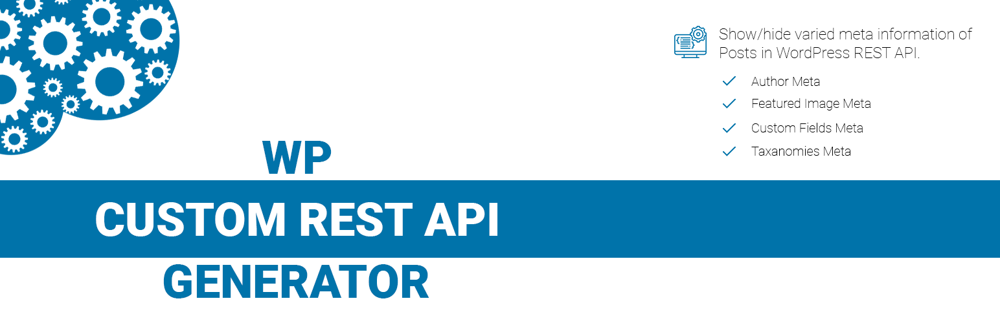



# WP Custom REST API Generator

WP Custom REST API Generator plugin provides an interface in WordPress Admin panel, which provides control to the user to show/hide Author Meta, Featured Image, Custom Fields and Taxonomies of all available Post Types for WordPress Rest API.

## Features

WP Custom REST API Generator comes with the following features;

 - Author Meta i:e. Author Name, Author Description, Author User Level, Author Avatar.
 - Featured Image with defined sized i:e. Small, Medium, Large, Full etc.
 - Custom Fields i:e. Fields defined by user for individual posts of different Post Types.
 - Taxonomies i:e. Default and Custom Taxonomies.
 
## Automatic installation

Automatic installation is the easiest option as WordPress handles the file transfers itself and you don't need to leave your web browser. To do an automatic install of this plugin, log in to your WordPress dashboard, navigate to the Plugins menu and click Add New.

In the search field type "WP Custom REST API Generator" and click Search Plugins. Once you've found this plugin, you can install it by simply clicking "Install Now".

## Manual installation

1.	Download and unzip the WP Custom REST API Generator plugin
2.	Upload the entire wp-custom-rest-api-generator/ directory to the /wp-content/plugins/ directory
3.	Activate the WP Custom REST API Generator plugin through the Plugins menu in WordPress

Customize the WP Custom REST API Generator settings at the administration menu >> Settings >> WP Custom REST API Generator

## License
WP Custom REST API Generator is distributed under the terms of GNU GPL2.

## Credits
WP Custom REST API Generator is based on following third-party resources:

### Resources
* Font Awesome 5 icons fonts https://fontawesome.com/, (C) Dave Gandy, [SIL Open Font License, version 1.1]

## Changelog

### 1.0.5
* Tested with the latest build

### 1.0.4
* Tested with the latest build

### 1.0.3
* Bug fixes, and tested with the latest build

### 1.0.2
* Tested with the latest build

### 1.0.1
* Updated meta information

### 1.0.0
* Initial release

